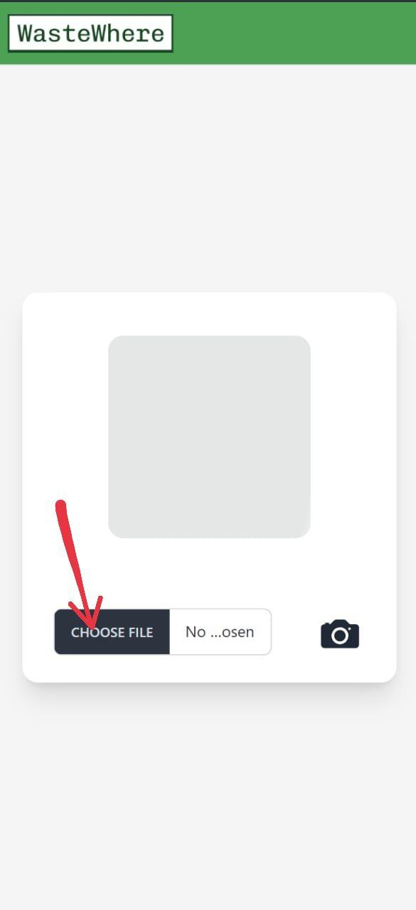
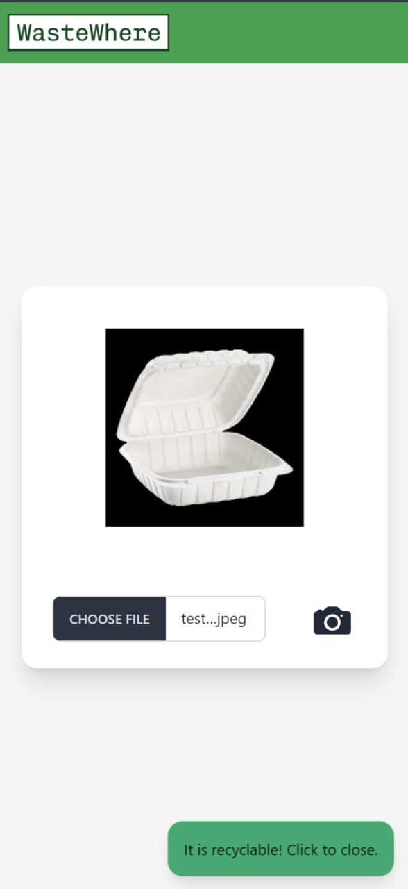
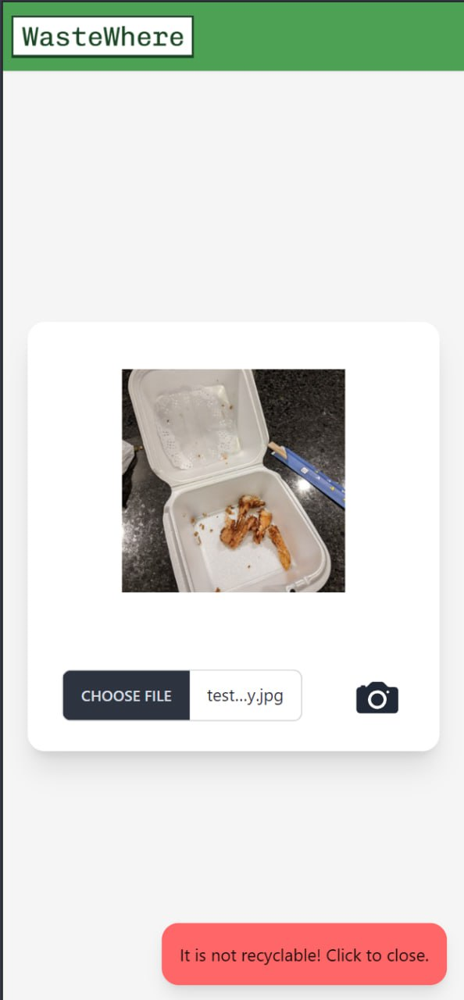

# WasteWhere


## Overview of WasteWhere
A web application that takes in a photo that the user takes of his possibly recyclable item and confirms if it is suitable for recycling based on the state i.e no food stains/liquids in it.

### Key features
1. Camera feature to immediately take a photo of the item
1. Uses a convolutional neural network (CNN) to determine if item in image is ready for recycling
1. Built for both desktop and mobile


Many young Singaporeans who have expressed strong interest and desire to recycle but lack the knowledge to recycle efficiently and effectively[^1]. Therefore, our solution aims to educates young Singaporeans on the proper condition of the item before recycling. 

WasteWhere empowers individuals to take charge of their recycling practices, promoting responsible waste management and reducing environmental impact. Together, we can make a positive difference for our planet 🌎.

With plans to integrate QR codes on recycling bins, users will be able to quickly scan and photograph items to instantly determine if they can be recycled. This simple process not only boosts awareness of recyclable materials but also helps reduce contamination in recycling bins, ensuring more effective waste management.

## Setup
### Pre-requisites:
- [NodeJS](https://nodejs.org/en/) v18 (*or above*)
- [Python](https://www.python.org/downloads/) v3.12.1 (*or above*)


### Building the app and installing packages
1. Run npm install inside the `frontend` folder

    ```$ cd frontend```

    ```$ npm install```

1. Build the react app

    ```$ npm run build```

1. Go back to the root directory and install the pip packages

    ```$ cd ..```

    ```$ pip install -r requirements.txt```

1. Run the flask server

    ```$ python app.py```

1. Access the web app from your browser. Typically it will be in `http://localhost:5000`

1. Click on `Choose File`

    

1. You may use your own image to classify if it is recyclable. Otherwise we have prepared 2 sample images in our project folder:

    - wastewhere/model/test_image_clean.jpeg
    - wastewhere/model/test_image_dirty.jpg

1. The web app will then process and return the classification of the image!

    
    

#### References
[^1]: https://www.channelnewsasia.com/singapore/in-focus-singapore-recycling-sustainability-blue-bins-waste-1339091
